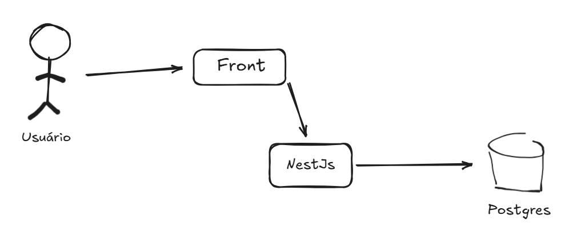
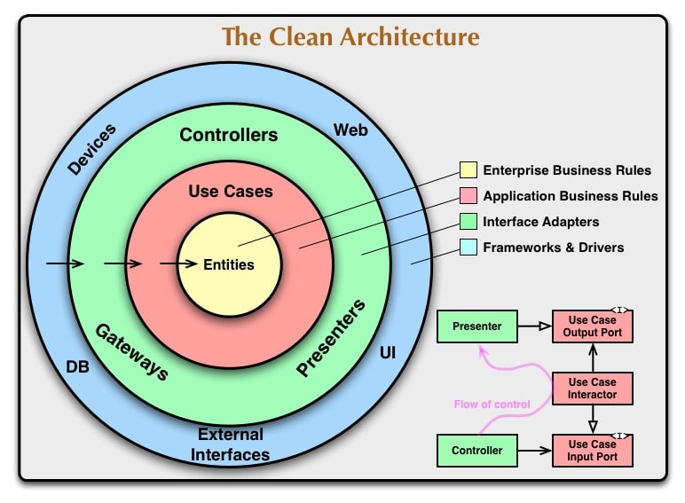
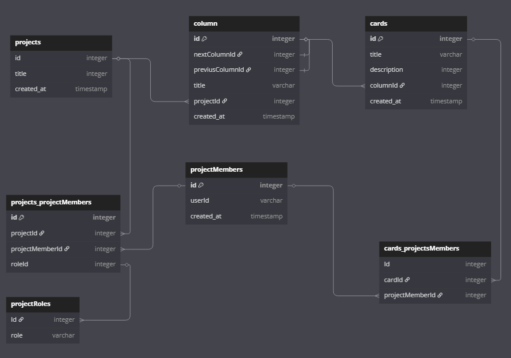
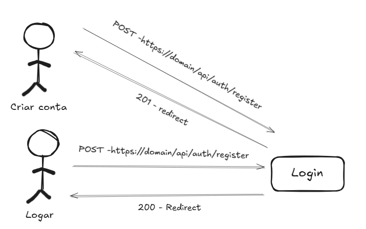
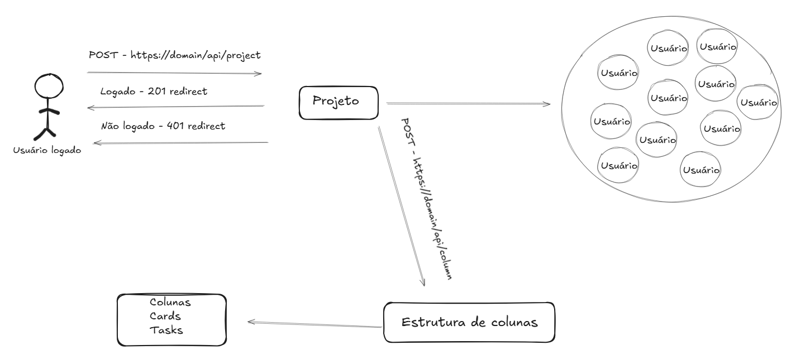
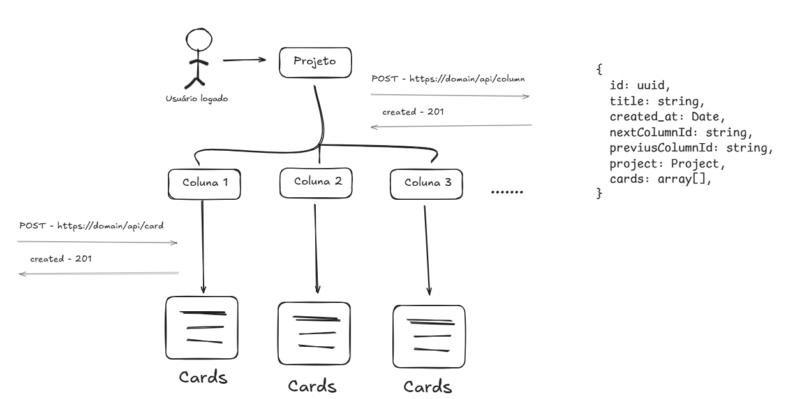
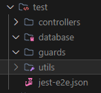

## Agile app

Este projeto se trata de um app para organização de projetos podendo utilizar várias técnicas de agile como Kanban, Scrum etc.
A escolha de fazer um projeto de organização é que além de implementar conceitos avançados de desenvolvimento no back, para realizar o front end também serão coisas legais e difíceis na implementação.


## Installation

```bash
$ npm install
```

## Running the app

```bash
# development
$ npm run start

# watch mode
$ npm run start:dev

# production mode
$ npm run start:prod
```

## Test

```bash
# unit tests
$ npm run test
$ npm run test:watch

# e2e tests
$ npm run test:e2e
$ npm run test:e2e:watch


# test coverage
$ npm run test:cov

# test debug
$ npm run debug
```

## Arquitetura

De um modo geral, olhando o mais de cima possível a arquitetura é com o NestJs e o banco de dados Postgres



**NestJS**

*NestJS é um framework para desenvolvimento de aplicações Node.js escaláveis e robustas, escrito em TypeScript (mas também suporta JavaScript puro). Ele é fortemente inspirado na arquitetura do Angular, adotando conceitos como injeção de dependência, modularização e decorators.
Escoli ele por ser um framework muito escalável, como ele é dividiso entre módulos, controladores e serviços, o que facilita a escalabilidade e a manutenção de grandes aplicações*

**Postgres**

*O PostgreSQL é um sistema de gerenciamento de banco de dados relacional (RDBMS) de código aberto, altamente poderoso, confiável e extensível. Ele é conhecido por seguir rigorosamente os padrões SQL e por oferecer recursos avançados que vão além dos bancos relacionais tradicionais.
Escoli o postgres por ser open source e como é um projeto pessoal acho que faz sentido usar open source*

**Docker**

*Docker é uma plataforma de containers que permite empacotar, distribuir e executar aplicações de forma isolada, leve e portátil, junto com todas as suas dependências.*

### Projeto (arquitetura)

Foi adotado a arquitetura Clean Architecture no projeto porque ela proporciona uma separação clara de responsabilidades, o que facilita significativamente a escrita de testes unitários e de integração. Com as dependências externas isoladas nas camadas mais externas da aplicação, consigo testar as regras de negócio de forma independente, garantindo maior manutenibilidade, escalabilidade e qualidade do código ao longo do tempo.
Essa estrutura modular facilita a substituição ou evolução de partes específicas do sistema com menor impacto geral, algo crítico em projetos que precisam crescer de forma sustentável. Em resumo, essa escolha arquitetural permite construir uma base mais sólida, mantendo a complexidade sob controle e garantindo que a cobertura de testes seja mais efetiva e confiável



## DB Design

Sobre o design do database. Para essa aplicação resolvi seguir com uma estrututra mais padrão e não seguir com um multi tenant por exemplo, pois por se tratar mais de um MVP ent~ao fez mais sentido seguir com a arquitetura mais comum de um banco de dados



## Feature

1- Autenticação

  Fluxo padrão de todas as aplicações é a autenticação, caso tenha conta faz o login se não cria a conta



2 - Criação de um projeto

  Com o usuário logado, ao bater na rota de criação do projeto, cria-se o projeto.
  No objeto do projeto fica o board com as colunas e cards e a lista de usuários que estão naquele projeto

  ```
  id: string,
  title: string,
  column: array[],
  created_at: string,
  projects_projectMembers: Array[],
  ```



3 - Criação das colunas e cards

Pode-se criar quantas colunas quiser e dentro de cada coluna temos a criação dos cards que terá a descrição das tarefas.
As colunas tem uma propriedade de `nextColumnId` e `previousColumnId`, dessa forma podemos saber qual é a última coluna, além de que caso queiramos arrastar os cards para a próxima coluna ou para a anterior, elas estão referenciadas.



## Testes

Para falar dos testes, foram criados tanto unitários e E2E/Integração. Como esse projeto é em NestJs, ele ja vem com o Jest instalado com ele.

**Jest**

*Jest é um framework de testes em JavaScript mantido pelo time do Facebook (Meta), muito utilizado em projetos Node.js e front-end (especialmente com React). Ele é conhecido por ser rápido, simples de configurar e completo.*

**Teste unitários**

Os testes unitários foram criados nas pastas dos próprios use-cases e controllers. 

**Testes E2E/Integração**

Para os testes E2E foi usado a estratégia do SQLite, pois como era para salvar e deletar os dados rapido por se tratar de teste, foi escolhido por ser mais simples e direto ao ponto.
Os teste E2E ficam dentro da pasta `test` na root do projeto, contendo todos os principais controllers testados com todas as features.



## License

Nest is [MIT licensed](LICENSE).
